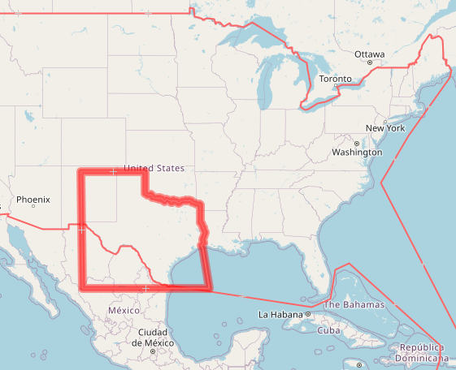

# Clipping polygons for download.geofabrik.de

This repository contains clipping polygon for download.geofabrik.de.
They are used to create the regional extracts of the planet dump using `osmium extract`.
The format is documented [on the OSM wiki](https://wiki.openstreetmap.org/wiki/Osmosis/Polygon_Filter_File_Format).

This repository is published in order to allow you to track the changes
to the clipping boundaries, and submit issues if you should find a bug.

## How it works

### Directory structure

In the `polygons` directory, you will find the polygons in (mostly) hierarchical order.
At the top level, there are continents (and Russia as intercontinental country, the US and Canada for historic reasons).
Below them you will find countries within continents, and states/provinces within their countries.
In addition, the top level directory contains some special clipping polygons which do not match a country or published extract
to split the world into few large subregions.

### How are clipping polygons used?

When the Geofabrik download server computes nightly OSM extracts, it does
so in a hierarchical fashion. First the contients are created from the planet
file, then the countries are cut from the continents, and so on.

Therefore, the clipping process does not have to know about boundaries where
they coincide with a higher level boundary. For example, because the
Southern border of Texas coincides with the border of the USA,
and because Texas is cut from the USA file,
this particular boundary only requires precise modelling in the 
USA polygon. In the Texas polygon, only those parts of the boundary
that are inside the USA are modelled precisely, whereas the Southern
border coarsely extends into Mexico - it doesn't matter since there 
will not be any data in that area when Texas is cut from the USA file.

*Texas (bold red line) and USA (thin red line) clipping boundaries.*

There is a tool in this repository called [intersectpoly](tools/intersectpoly.cc) and we use this to create the smallest common area of several polygons, 
so that the polygons (or GeoJSON index files) we offer on the download
server show the actual polygon contained in the extract. They will differ
from the polygons in this repository.

### What is included in the polygons, what is missing?

See [CONTRIBUTING.md](CONTRIBUTING.md) for buffer sizes, degree of simplification, handling of exclaves etc.

## License

Polygons are an OpenStreetMap produced work in terms of the Open Database License 1.0. When using them, you are required to attribute OpenStreetMap.

Software is released into the public domain.
